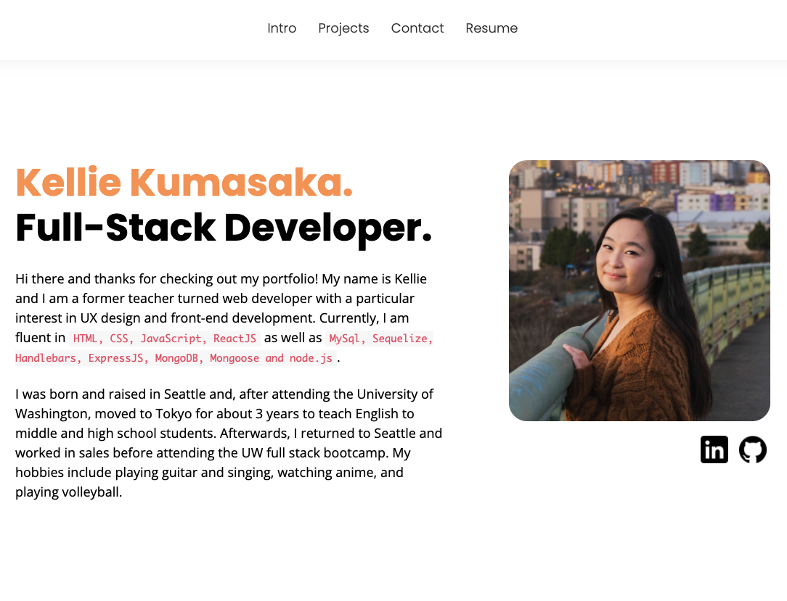
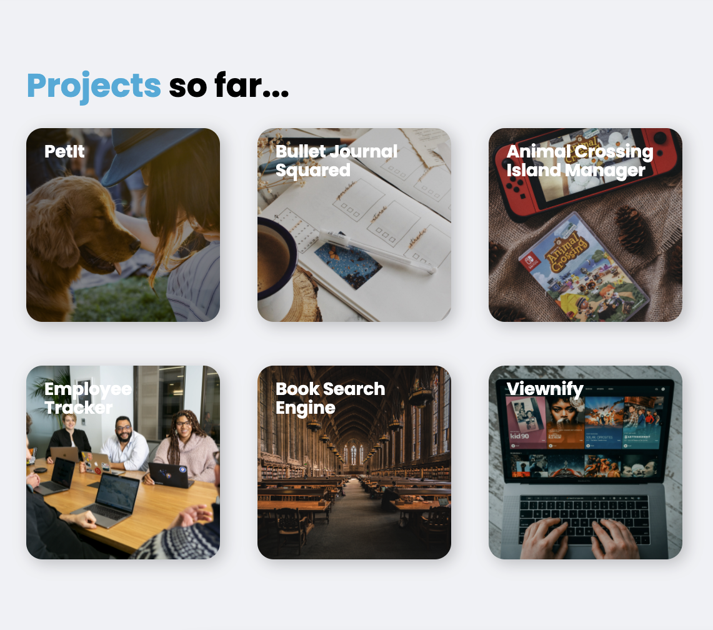

# React Portfolio 
## About
This is my personal website with containing my contact information, resume, an brief introduction, and some projects that I've worked on.

## Deployment

    https://kelliekumasaka.herokuapp.com/

## Description
When you first enter the website, you are met with a welcome page with a navbar that has a few different links. At the bottom of the site, there are links to contact me and view my social media.

Upon clicking on the `Projects` tab in the navbar, you are met with a timeline depicting some of my projects and notable assignments.

## Table of Contents
* [Installation](#installation)
* [Usage](#usage)
* [Contributing](#contributing)
* [Tests](#tests)
* [License](#license)
* [Questions](#questions)

## Installation
To run this website, you need to have `react` installed, as well as the `uikit` package.

## Usage

## Contributing
### Nyle Miura - Website Designer
    https://www.linkedin.com/in/nylemiura/

## Tests

## License
This project is licensed under MIT.

## Questions
Here is a link to my [GitHub](https://github.com/kelliekumasaka) or shoot me an [email](mailto:kelliek3@gmail.com).
